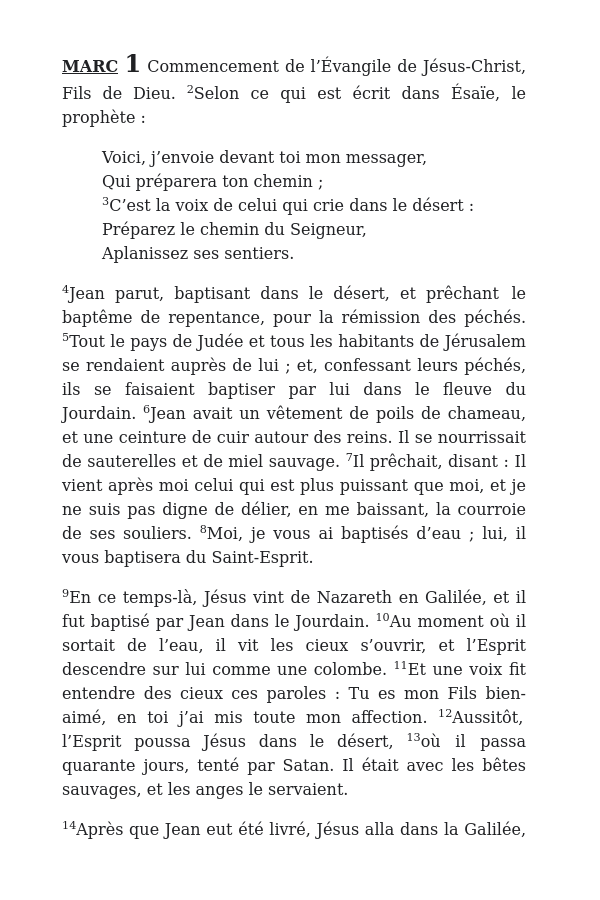

Public domain Bibles packaged as EPUB files.

<!--- TODO
See the [Releases](../../releases) page for the files.
--->

<!--- TODO: update link to cover.jpg once https://github.com/kcartlidge/nodepub/issues/17 is fixed --->



## About

This is a simple attempt to generate well-formatted EPUB Bibles intended primarily for use with E-readers.

This is loosely inspired by [Standard Ebooks](https://standardebooks.org/), which [does not include Bibles as part of their collection](https://standardebooks.org/contribute/collections-policy).

## How to read these files

### E-readers

For most E-readers (Kobo, Nook, etc.), you should just be able to copy the file to your E-reader.

For Kindle E-readers, you will need to convert them first to MOBI files using a tool such as [calibre](https://calibre-ebook.com/).

### Other devices

Because these files are limited to Bibles available in the public domain, if you wish to read the Bible on another device in most cases it would be preferable to read a more modern translation using a different method such as the [Bible app](https://www.bible.com/app) or [bible.com](https://www.bible.com/bible/).

#### Android

You can read these files using the [Google Play Books](https://play.google.com/store/apps/details?id=com.google.android.apps.books) app, or an alternative such as [Book Reader](https://play.google.com/store/apps/details?id=com.github.axet.bookreader&hl=fr&gl=US).

#### iOS

You can read these files using the iBooks app.

#### Linux/Mac/Windows

You can read these files using an app such as [calibre](https://calibre-ebook.com/).

## Features

- Custom covers featuring public domain art in the style of [Standard Ebooks](https://standardebooks.org/) covers
- Table of contents with entries only for each book
- Content page for each book with entries for each chapter
  - The heading links back to the main table of contents
- Chapter titles that link back to the book content page
- Uniform line spacing
- Punctuation fixes
- Deliberately minimal styling (no custom fonts, margins, etc) since most E-readers have very good default styling

## Other free EPUB Bible sources

- [ESV Classic Reference Bible](https://www.crossway.org/books/esv-classic-reference-bible-ebook/)
- [https://ebible.org/download.php](https://ebible.org/download.php)

## Development

### Creating the EPUB files

#### Prerequisites

1. Install Node.js (see `engines` in [package.json](scripts/package.json) for the specific version to install)
1. Install dependencies

   ```
   cd scripts
   npm install
   ```

#### Steps

```
cd scripts
npm start
```

### Creating a cover image

#### Prerequisites

1. Install the Standard Ebooks tools: [https://github.com/standardebooks/tools#installation](https://github.com/standardebooks/tools#installation)

1. Install the League Spartan font

   1. Download the latest release from here: [https://github.com/theleagueof/league-spartan/releases](https://github.com/theleagueof/league-spartan/releases)

   1. Extract LeagueSpartan-N.NNN/static/TTF/LeagueSpartan-Regular.ttf from the downloaded file

   1. Install the font

      ```
      mkdir -p ~/.fonts/
      cp /path/to/LeagueSpartan-Regular.ttf ~/.fonts/
      fc-cache -f -v
      ```

#### Steps

1. Find a public domain image to use as the cover

   - This is a nice source: [https://www.brooklynmuseum.org/opencollection/exhibitions/3207](https://www.brooklynmuseum.org/opencollection/exhibitions/3207) > _Objects_
   - Other sources are listed here: [https://standardebooks.org/manual/1.6.2/10-art-and-images#10.3.3.6.2](https://standardebooks.org/manual/1.6.2/10-art-and-images#10.3.3.6.2)

1. Download and crop the source image

1. Create a temporary directory

   ```
   mkdir tmp
   cd tmp
   ```

1. Run `se create-draft`, e.g.

   ```
   $ se create-draft -a Anonymous -t "La Bible Segond 1910"
   ```

   - The title will go on top in a larger font, the author will go on the bottom in a smaller font
   - Use "Anonymous" for the author to exclude it from the cover image

1. Copy the image, e.g.

   ```
   $ cp ../data/fr/La\ Bible\ Segond\ 1910/cover-source.jpg anonymous_la-bible-segond-1910/images/cover.jpg
   ```

1. Build the image, e.g.

   ```
   $ se build-images anonymous_la-bible-segond-1910/
   ```

1. Build the ebook, e.g.

   ```
   $ se build --output-dir=dist anonymous_la-bible-segond-1910/
   ```

1. Extract the generated cover image, e.g.

   ```
   $ unzip -j dist/anonymous_la-bible-segond-1910.epub epub/images/cover.jpg -d .
   ```

1. Move the generated cover image somewhere

   ```
   $ mv cover.jpg ../data/fr/La\ Bible\ Segond\ 1910/
   ```

1. Cleanup

   ```
   cd ..
   rm -rf tmp
   ```

### Creating sample page image

1. Open Google Play Books
1. Select html element in browser dev tools
1. Drag width until it's 600 pixels wide
1. Take screenshot of browser window
1. Open in GIMP
1. _Image_ > _Canvas Size_
1. Resize image to 600 x 900
1. Offset: X: -10, Y: -130
1. Erase the top and bottom content manually with eraser
1. Export image
